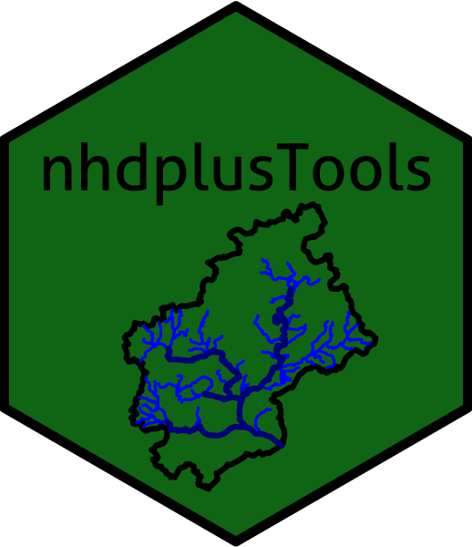

```{r setup, include=FALSE}
options(htmltools.dir.version = FALSE)
library(flair)
library(icons)
library(here)
library(tidyverse)
library(xaringanthemer)

# theme the css
xaringanExtra::use_xaringan_extra(include = c("tile_view", "share_again", "editable"))
xaringanExtra::use_extra_styles(hover_code_line = TRUE, mute_unhighlighted_code = TRUE)

style_duo_accent(
  primary_color = "#1b9aaa",
  # darkblue: #002855, orange: #ffc43d, steelblue: #1b9aaa
  secondary_color = "#ffc43d",
  #title_slide_background_image = "flare_helix.png", 
  #title_slide_background_position = "bottom 490px left 250px",
  #title_slide_background_size = "40%",
  text_font_google = google_font("Roboto"),  #<< Playfair Display, Bebas Neue
  header_font_google = google_font("Sansita"), 
  link_color = "#C71585",
  #<< crazy: Trade Winds, Bangers, Julius Sans One, IBM Plex Sans Condensed
  text_font_size = "1.4rem",
  # add specific colors (access w .color[])
  colors = c(
  red = "#f34213",
  purple = "#3e2f5b",
  orange = "#ff8811",
  green = "#136f63",
  magenta = "#8B008B",
  white = "#FFFFFF")
  #title_slide_background_color = "steelblue"
)

# chunk defaults
knitr::opts_chunk$set(
  fig.showtext = TRUE,
  echo=FALSE, 
  fig.retina = 3, warning = FALSE, 
  message = FALSE,
  fig.width = 16,
  fig.height = 8,
  dpi = 300
)

```

class: center, top, inverse-black
background-image: url(041912_Panorama_NYUBA.jpg)
background-size: contain

# Wrangling Ridiculous River Data

### Linking Biological Stream Condition with Flow Alteration

<br><br><br><br><br><br>
.large[Ryan Peek | 2022 Feb 10 ]

<span style = "font-size: 100%;">`r icons::fontawesome("twitter")` [riverpeek](https://twitter.com/riverpeek)</span>

---

layout: true
  
<div class="my-footer"><span>2022 • @riverpeek</span></div> 


---
class: top, center
background-image: url("colfax_1891.png")
background-size: cover

## .magenta[A winding path]

---
class: center, middle, inverse

# Data in California

## an ever-present wave


---
class: center, middle

# So how can we use it for good? 


---
class: top, inverse-black

## People think Data Science is...

```{r, echo=FALSE, out.width='85%', fig.align='center'}

knitr::include_graphics("https://media.wired.com/photos/5ca648a330f00e47fd82ae77/master/w_2560%2Cc_limit/Culture_Matrix_Code_corridor.jpg")

```
 
---
class: inverse, top
background-image: url(hexes/dplyr.png), url(hexes/sf.gif), url(hexes/tidyr.png)
background-position: 98% 2%, 92% 2%, 86% 2%
background-size: 5%, 5%, 5%


## Actual Data Science is this... 

```{r echo=F, eval=TRUE, out.width='70%'}

# these are all from Allison Horst: https://github.com/allisonhorst/stats-illustrations

# CITE AS: "Artwork by @allison_horst"

knitr::include_graphics(path="https://raw.githubusercontent.com/allisonhorst/stats-illustrations/master/rstats-artwork/data_cowboy.png")

```

.font60[
*Illustration by @allison_horst, from Hadley Wickham's talk 'The Joy of Functional Programming (for Data Science)'"*
]


 - [*see great visualization of same data 25 ways!*](https://flowingdata.com/2017/01/24/one-dataset-visualized-25-ways/)

---
class: center, top, inverse
name: rivers-intro
background-image: url('slate_ck_aerial_v2.png')
background-size: 70%
background-position: 50% 50%

<br>

# Rivers

--

<br><br>

## Dams

---
class: top, left
background-image: url('dams_in_west.png')
background-size: 50%
background-position: 100% 30%


.pull-left[

### Over 1,400 large dams in CA

- 95% of streams of have altered flows (depleted or inflated)

]

???
45% of salmonids to be extirpated by 2050, 75% extirpated by 2100

---
class: inverse, incremental
name: plot

# Environmental Flows

 - Many programs are attempting to set environmental flows...

--

 - CA is physically diverse & management needs vary

--

 - Coordination & sharing information between groups is challenging!

--

 - .red[Uncertainty] in most appropriate method

--

 - **Balancing ecological flow needs & other demands is hard**

---
class: right
name: functionalflows
background-image: url('ffcomponent_w_nfa_data.png')
background-size: contain

## .font80[Functional Flow Components]

???

Aspects of flow regime that directly relate to ecological, geomorphic or biogeochemical processes in riverine systems

Expected to support foundational physical and ecological processes that sustain biological communities.

A functional flow regime recognizes ALL 5 components. No single component is a functional flow regime.

Biotic stress in dry season low flow period, abiotic in peak flow periods

---
class: bottom, left, inverse-black
background-image: url(nfy_recession_bar.png)
background-size: cover

# Receding flows!


---
class: top, left, inverse-black

# Functional Flow Calculator

 - Available at [eflow.ucdavis.edu](eflows.ucdavis.edu)
 - `R` **FFC** Calculator: [https://ceff-tech.github.io/ffc_api_client/](https://ceff-tech.github.io/ffc_api_client/)


---


--


---
class: center

# .black[Biological Stream Condition Data]

.pull-left[

### .orange[CSCI (California Stream Condition Index)]

- over 300,000 samples from 1994-2018
- many stations across the state

]

.pull-right[

### .green[ASCI (Algal Stream Condition Index)]

 - more recent dataset, but equally large
 
]

---
class: center, bottom

### CSCI Scores Variable by site and season


---
class: middle, inverse
background-image: url(03_tmap_all_bio_sites.png)
background-size: contain
background-position: 100% 50%

.pull-left[

### Biological Sites
###.font80[Many sites, but not all overlapped!]

]

---
class: middle, inverse
background-image: url(03_tmap_usgs_sites_all.png)
background-size: contain
background-position: 100% 50%

.pull-left[

### USGS gages across California

### .font80[Variable data intervals & date ranges]
]

---
class: top

## And now data science!

.pull-left[

 
```{r, out.width="40%"}
knitr::include_graphics("../slides/hexes/mapview.gif")
```

```{r, out.width="50%"}
knitr::include_graphics("../slides/hexes/dplyr.png")
```
```{r, out.width="30%"}

```

]

.pull-right[

```{r, out.width="47%"}

```
```{r, out.width="30%"}
knitr::include_graphics("../slides/hexes/purrr.png")
```
```{r, out.width="30%"}
knitr::include_graphics("../slides/hexes/readr.png")
```
```{r, out.width="40%"}
knitr::include_graphics("../slides/hexes/ggplot2.png")
```
]

---
class: inverse

## But merging datasets & pairing sites...

.center[
```{r, out.width="70%"}
knitr::include_graphics("Messy_storage_room_with_boxes.jpg")
```
]

---
class: inverse-black

## General Approach


---

## Mapview: Map of Sites

[Open map here](03_map_of_final_bmi_csci_sites.html)

```{r echo=TRUE, eval=FALSE}

library(mapview)
library(dplyr)

# set background basemaps:
basemapsList <- c("Esri.WorldTopoMap", "Esri.WorldImagery","Esri.NatGeoWorldMap",
                  "OpenTopoMap", "OpenStreetMap", "CartoDB.Positron")
mapviewOptions(basemaps=basemapsList, fgb=FALSE) #<<

# map
m3 <- mapview(bmi_final_dat, cex=6, col.regions="orange",layer.name="Selected BMI CSCI") +
  mapview(mainstems_all %>% filter(from_gage=="UM"), color="forestgreen", cex=3, layer.name="NHD Flowlines US") + 
  mapview(mainstems_distinct, color="steelblue", cex=3, layer.name="NHD Flowlines DS") +
  mapview(gages_selected_v2, col.regions="skyblue", cex=7, color="blue2", layer.name="Selected USGS Gages") +
  # these are all bmi or gages in same H12 but not selected
  mapview(gages_not_selected_v2, col.regions="slateblue", color="gray20", cex=3.2, layer.name="Other USGS Gages") +
  mapview(bmi_not_selected_v2, col.regions="gold", color="gray20", cex=3.2, layer.name="Other BMI Sites in H12") +
  mapview(hucs_selected_v2, col.regions="orange3", alpha.region=0.1, color="orange", legend=F, layer.name="Selected HUC12") +
  mapview(hucs_not_selected_v2, col.regions="dodgerblue", alpha.region=0.1, color="darkblue", legend=F, layer.name="Other HUC12")
```

---
class: left, top, inverse
background-image: url(03_tmap_selected_bio_sites_combined_wgages.png)
background-size: contain
background-position: 100% 50%

# Final Sites

.pull-left.w40[
- represent multiple regions
- but meager in some places
]

---
class: left, top, inverse
background-image: url(03_tmap_selected_bio_sites_strmclass.png)
background-size: contain
background-position: 100% 50%

## Stream Classes

.pull-left.w40[
- Collapsed to 3 (based on Patterson et al. 2020)
]

---
class: inverse, top

# Results

 - seasonality one of strongest factors
 - as was Fall Pulse and Dry Season Baseflows

---
class: left, top
background-image: url(fig4_boxplot_of_asci_csci_ffm_by_deltaH.jpg)
background-size: 90%

---
class: left, inverse, top
background-image: url(fig8_gbm_combined_snow_rain_mixed_seasonality_all_ri_sized_points_w_lines_horiz_v2.jpg)
background-size: contain
background-position: 100% 50%

---
class: center, inverse-black

# Thanks!

